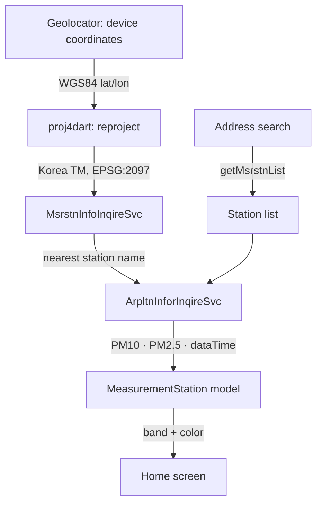

# Fine Dust Tracker

> A Flutter app that reads PM10 and PM2.5 from the monitoring station nearest to you, not from the region you happen to be filed under.

[](https://opensource.org/licenses/MIT)


## Motivation

Air quality is reported by administrative region, but it is not measured that way. It is measured at a station, and the station nearest to you can sit several kilometers off and read differently from the district average that a weather app shows. On a bad day that difference is the difference between opening a window and not.

So this app resolves a station rather than a place name. It takes the phone's coordinates, asks the public API which monitoring station is closest, and reports that station's numbers and nothing else. The station's name is shown alongside the reading, because a measurement without knowing where it was taken is the thing this was built to avoid.

It was also the first app built after finishing a Flutter course, which shows in places the Limitations section names.

## What It Does

- Finds the monitoring station closest to the phone's current position and shows its PM10 and PM2.5 readings
- Labels each reading on an eight-band scale, from `최고` to `최악`, and tints the whole screen to match
- Shows the station name and the time the reading was taken, so a stale number is visible as stale
- Searches stations by address, so a reading can be pulled for somewhere other than where the phone is
- Refreshes on demand with a tap

## Architecture

Two public endpoints are chained, because neither one alone gets from a coordinate to a measurement.



Both endpoints are asked for XML and parsed with the `xml` package. There is no backend, no database, and no caching layer. Every refresh is a fresh pair of network calls, and application state lives in one `StatefulWidget` driven by `setState`.

### Stack

`geolocator` · `geocoding` · `proj4dart` · `http` · `xml` · `flutter_dotenv` · `intl`

## Tech Decisions

| Component | Choice | Why this over alternatives |
| --- | --- | --- |
| Location target | Nearest station by coordinates (over a region name) | A region name would have been one API call instead of two, but it answers a different question. The reading a person cares about is the one taken closest to them, and the station that produces it does not follow district boundaries |
| Coordinate system | Reprojection to Korea TM via `proj4dart` (over sending lat/lon) | The nearby-station endpoint does not accept WGS84. It takes Korea's legacy TM grid, which sits on the Bessel 1841 ellipsoid, so a seven-parameter datum shift is required rather than a simple formula. That transform string is the single least obvious line in the project |
| Air quality bands | Eight bands (over the official four) | Four bands put a wide range of readings under one word, and `보통` covering most of the year makes the label useless for deciding anything. Eight bands move with the number. The cost is that these are not the bands the public sees elsewhere, and the thresholds' source is not recorded anywhere in the project |
| API key | `flutter_dotenv` with `.env` outside version control | The data.go.kr key is per-account and rate limited, so it cannot ship in the repo. A build-time `--dart-define` would be tidier for CI, but there is no CI here and a `.env` file is one less thing to explain in setup |
| State | `setState` in one screen (over a state management package) | There is one screen and no state shared across routes. Provider or Riverpod would have added a layer whose entire job is a problem this app does not have |

## Results & Limitations

**Nothing here has been measured.** There are no tests, no benchmarks, and no crash reporting. The app runs on the developer's device and has never been released or installed by anyone else.

The one committed test is the scaffold `widget_test.dart` that `flutter create` generates, still asserting on a counter that this app does not have. It is not a passing test that covers nothing; it is a failing test nobody ran.

Known defects, all present in the current code:

- **A missing reading displays as the best possible air quality.** The API returns `-` when a station has no value for the hour. `int.tryParse('-')` gives null, `?? 0` turns it into `0`, and the model's guard for missing data checks `< 0`, so it never fires. The screen then labels `0` as `최고` and paints itself deep blue. The intent to handle missing data is in the code and the sentinel does not match what the API actually sends.
- **The retry loops are far too aggressive.** `fineDustAPIService` retries up to 100 times **with no delay between attempts**, so a failing station hammers a public API with a hundred consecutive requests. `locationAPIService` retries up to 100 times with a 2 second delay, which blocks the UI for over three minutes before giving up. Neither loop distinguishes a transient 5xx from a rejected key, so an invalid key retries a hundred times and then fails silently.
- **A one-element placemark list crashes the lookup.** `locationAPIService` checks `placemark.isNotEmpty` and then reads `placemark[1]`, which throws a range error whenever reverse geocoding returns exactly one result.
- **Errors are swallowed.** The XML parse in the location service is wrapped in `catch (e) {}` with an empty body, and `searchAPIService` never checks the status code before parsing. A failed call is indistinguishable from a station with no data.
- **Field extraction uses `.single`.** `pm10Value`, `pm25Value`, and `dataTime` are pulled with `findAllElements(...).single`, which throws if the field is absent rather than falling back.
- **Dependency versions are unconstrained.** Everything except `flutter_dotenv` and `cupertino_icons` is declared as `any` in `pubspec.yaml`. The committed `pubspec.lock` keeps the current build reproducible, but a `flutter pub upgrade` would accept any future breaking release without complaint.
- **No screenshots.** This is a UI product documented without a single image of its UI.

## Getting Started

### Prerequisites

- Flutter SDK `>=3.4.0 <4.0.0`
- A service key from [data.go.kr](https://www.data.go.kr), issued for the AirKorea services below

### Setup

1. Clone and enter the repository:

   ```bash
   git clone https://github.com/liminal-cipher/fine-dust-tracker.git
   cd fine-dust-tracker
   ```

2. Install dependencies:

   ```bash
   flutter pub get
   ```

3. Create a `.env` file in the project root. It is gitignored:

   ```
   API_KEY=your_data_go_kr_service_key
   ```

4. Run:

   ```bash
   flutter run
   ```

Location permission is requested on first launch. Denying it leaves the current-location path with nothing to resolve; address search still works.

### APIs Used

Both are AirKorea services published through data.go.kr, and one service key covers both.

| Service | Endpoint | Purpose |
| --- | --- | --- |
| `MsrstnInfoInqireSvc` | `getNearbyMsrstnList` | Nearest station for a Korea TM coordinate |
| `MsrstnInfoInqireSvc` | `getMsrstnList` | Station lookup by address |
| `ArpltnInforInqireSvc` | `getMsrstnAcctoRltmMesureDnsty` | Hourly PM10 and PM2.5 for a station |

## Retrospective

**The coordinate transform was the part worth building, and it is the part that is documented nowhere in the code.** Getting from a phone's GPS position to a Korean monitoring station means crossing from WGS84 to a grid defined on a nineteenth-century ellipsoid, and the seven-parameter shift that makes it correct is a bare string in the middle of a service function. Anyone reading that file, including a later me, has no way to tell whether those numbers are right or where they came from. If there is one comment this project needed, it is that one.

**The error handling was written for the API behaving well.** A hundred retries with no delay is not a retry policy, it is a loop that happens to stop. The missing-value bug comes from the same place: the model has a branch for absent data, so the case was thought about, but the sentinel guarding it was chosen without checking what the API actually returns for a missing hour. Reading one real error response would have caught both.

If picked up again, the order would be a real value type for a reading that can be absent, then a retry policy that separates transient failures from permanent ones, then screenshots.

## Status

Frozen. Personal project, built 2024-05 as the first app after a Flutter course, with station search added 2026-03. It still runs, but there is no active plan to resume work. Last updated 2026-08-13.

## License

MIT. See [LICENSE](LICENSE).
